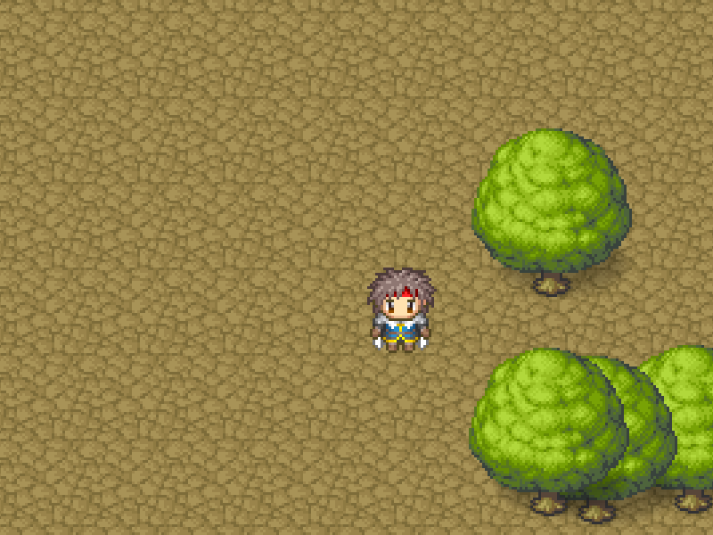
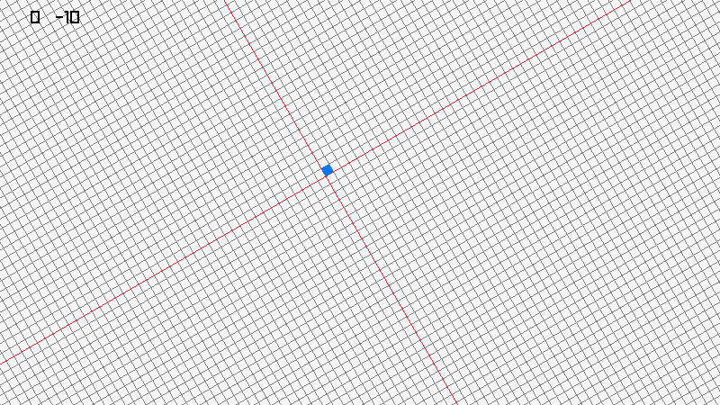

**Additional raylib examples from third-party developers.**
Rewritten for the Pascal language.

**Ergo** 
https://github.com/brihernandez/Ergo

Fly a little ship around in a raylib project. The main purpose of this project has to figure out how to handle arbitrary rotations, since the built in rotation functions don't make this easy.

**Toon Shader**
https://bedroomcoders.co.uk/cell-shader-revisited/

I think Cell Shaders give a great style to games, often allowing you to utilise low poly models that end up looking great. I was going to also look at maybe altering the way that the out lining shader works slightly, but on balance I like the way it looks, so I left it as is too.

**RPG Camera 2D**

I Small example uses camera 2d in rpg style

**Morphing Example**

An example of the transformation of one object into another.

**Example of mouse drag panning for 2D camera**

Example of mouse drag panning for 2D camera

**World space panning**

Example of world space panning

**FPS shoot bullet**

FPS shoot bullet 3d example

